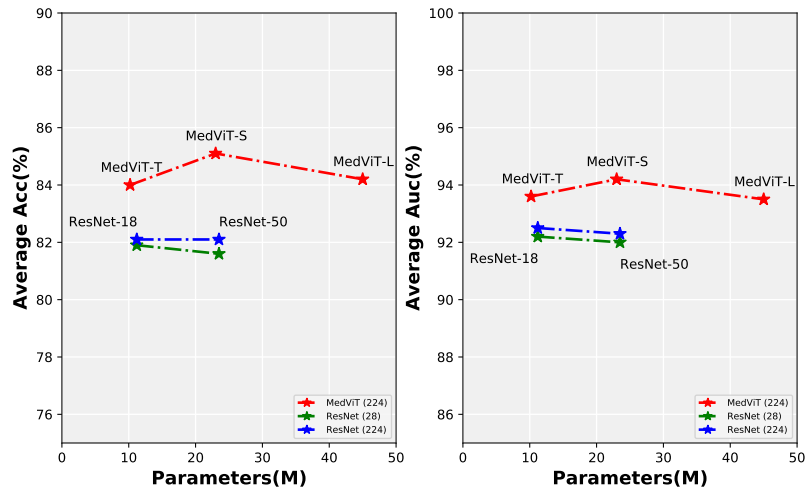
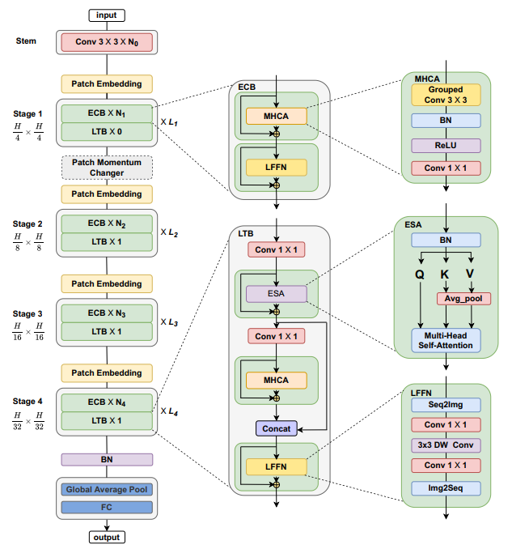
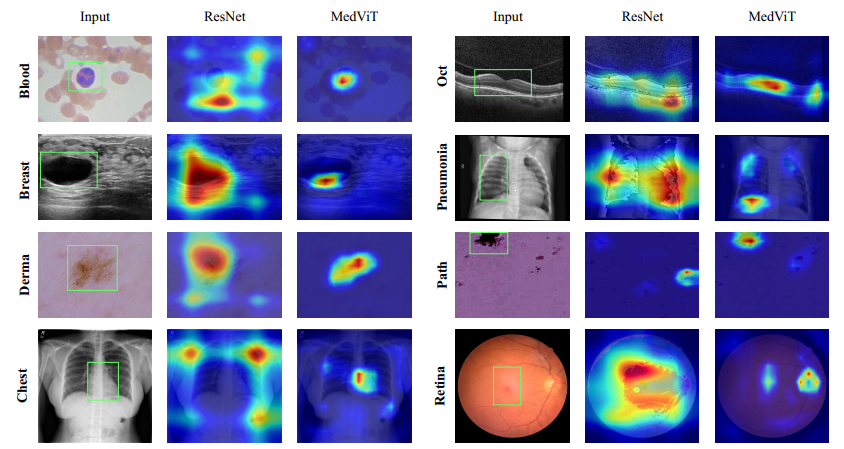

# MedViT: A Robust Vision Transformer for Generalized Medical Image Classification

[](https://arxiv.org/abs/2302.09462)
[](https://doi.org/10.1016/j.compbiomed.2023.106791)

This repo is the official implementation of MedViT: A Robust Vision Transformer for Generalized Medical Image Classification.


  
## Train & Test --- Prepare data
- (beginner friendly🍉) To train/evaluate MedViT on Cifar/Imagenet/CustomDataset follow ["CustomDataset"](https://github.com/Omid-Nejati/MedViT/blob/main/CustomDataset.md). 
- (New version) Updated the code ["Instructions.ipynb"](https://github.com/Omid-Nejati/MedViT/blob/main/Instructions.ipynb), added the installation requirements and adversarial robustness. [](https://colab.research.google.com/github/Omid-Nejati/MedViT/blob/main/Instructions.ipynb)


## Introduction
Convolutional Neural Networks (CNNs) have advanced existing medical systems for automatic disease diagnosis. However, there are still concerns about the reliability of deep medical diagnosis systems against the potential threats of adversarial attacks since inaccurate diagnosis could lead to disastrous consequences in the safety realm. In this study, we propose a highly robust yet efficient CNN-Transformer hybrid model which is equipped with the locality of CNNs as well as the global connectivity of vision Transformers. To mitigate the high quadratic complexity of the self-attention mechanism while jointly attending to information in various representation subspaces, we construct our attention mechanism by means of an efficient convolution operation. Moreover, to alleviate the fragility of our Transformer model against adversarial attacks, we attempt to learn smoother decision boundaries. To this end, we augment the shape information of an image in the high-level feature space by permuting the feature mean and variance within mini-batches. With less computational complexity, our proposed hybrid model demonstrates its high robustness and generalization ability compared to the state-of-the-art studies on a large-scale collection of standardized MedMNIST-2D datasets. 
<div style="text-align: center">

</div>
Figure 1. Comparison between MedViTs and the baseline ResNets, in terms of average ACC-Parameters and average AUC-Parametrs trade-off over all 2D datasets.</center>


## Overview

<div style="text-align: center">

</div>
Figure 2. The overall hierarchical architecture of MedViT.</center>

## ImageNet Pre-train
We provide a series of MedViT models pretrained on ILSVRC2012 ImageNet-1K dataset.

| Model      |   Dataset   | Resolution  | Acc@1 | ckpt   |  
|------------|:-----------:|:----------:|:--------:|:--------:|
| MedViT_small | ImageNet-1K |    224   | 83.70 | [ckpt](https://drive.google.com/file/d/14wcH5cm8P63cMZAUHA1lhhJgMVOw_5VQ/view?usp=sharing) | 
| MedViT_base | ImageNet-1K |    224    | 83.92 |[ckpt](https://drive.google.com/file/d/1Lrfzjf3CK7YOztKa8D6lTUZjYJIiT7_s/view?usp=sharing) | 
| MedViT_large | ImageNet-1K |    224   | 83.96 |[ckpt](https://drive.google.com/file/d/1sU-nLpYuCI65h7MjFJKG0yphNAlUFSKG/view?usp=sharing) | 

## Visualization

Visual inspection of MedViT-T and ResNet-18 using Grad-CAM on MedMNIST-2D datasets. The green rectangles is
used to show a specific part of the image that contains information relevant to the diagnosis or analysis of a medical condition,
where the superiority of our proposed method can be clearly seen.

<center>Figure 3. The heat maps of the output feature from ResNet and MedViT.</center>

## Citation
If you find this project useful in your research, please consider cite:
```
@article{manzari2023medvit,
  title={MedViT: A robust vision transformer for generalized medical image classification},
  author={Manzari, Omid Nejati and Ahmadabadi, Hamid and Kashiani, Hossein and Shokouhi, Shahriar B and Ayatollahi, Ahmad},
  journal={Computers in Biology and Medicine},
  volume={157},
  pages={106791},
  year={2023},
  publisher={Elsevier}
}
```
## Star History

[](https://star-history.com/#Omid-Nejati/MedViT&Date)

## Acknowledgement
We heavily borrow the code from [RVT](https://github.com/vtddggg/Robust-Vision-Transformer) and [LocalViT](https://github.com/ofsoundof/LocalViT).

## Contact Information

For any inquiries or questions regarding the code, please feel free to contact us directly via email:

- Omid Nejaty: [omid.nejaty@gmail.com](mailto:omid.nejaty@gmail.com)
- Hossein Kashiani: [hkashia@clemson.edu](mailto:hkashia@clemson.edu)
